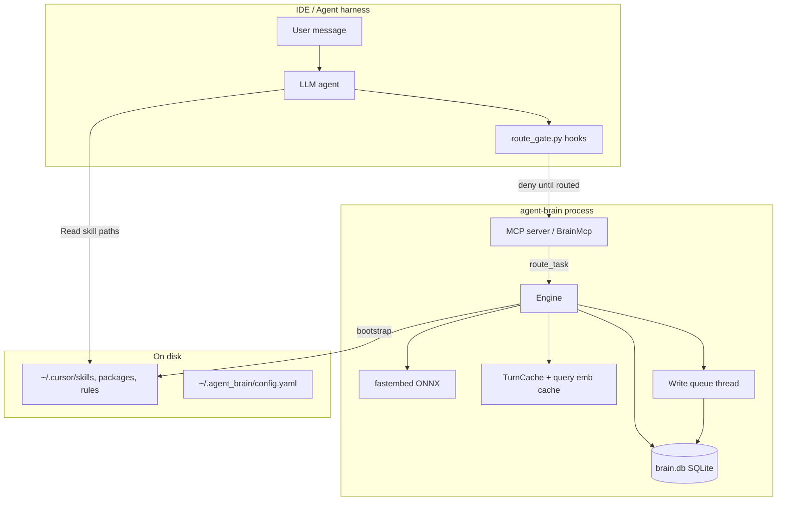

# 2. System overview

## Summary

agent-brain is a single Rust binary. **`serve`** exposes an MCP stdio server; the **Engine** owns routing, indexing, and memory; **BrainStore** (SQLite) is the source of truth; **Cursor hooks** enforce routing before other tools run.

## High-level diagram



## Request flow (one user turn)

1. User sends a message in Cursor Agent mode.
2. **preToolUse hook** runs before Shell/Read/Write/MCP (scoped by `AGENT_BRAIN_ROUTE_GATE_SCOPE`).
3. If `route_task` has not succeeded for this turn, hook returns **deny** with a message to call agent-brain MCP first.
4. Agent calls **`route_task`** with `user_message`, `current_working_directory`, `open_files`.
5. Engine:
   - Infers **phase** (reviewing, implementing, debugging, planning) from message keywords
   - Checks **turn cache** (same scope + phase + query fingerprint)
   - Runs **BM25 prefilter** + **query embedding** + **hybrid scoring**
   - Builds `RouteTaskResponse` under token budget
   - Logs to `retrieval_log`, writes `last-route.md` briefing
6. Hook records success; other tools unlock.
7. Agent loads recommended skill paths, applies rules/memory, does work.
8. At task end, agent may call **`store_memory`** (queued write).

## Major components

| Module | Responsibility |
|--------|----------------|
| `main.rs` | CLI: install, doctor, sync, memory gc, digest, eval |
| `mcp/server.rs` | MCP tool definitions, `serve` entry |
| `engine.rs` | `route_task`, `get_context`, bootstrap orchestration |
| `db/store.rs` | SQLite, FTS, scoring, facts, index rows |
| `db/write_queue.rs` | Serialized writes for imports and memory |
| `index.rs` | Filesystem walk, SKILL.md parsing, upsert |
| `embed.rs` | ONNX embeddings, deterministic mode for tests |
| `retrieval.rs` | FTS query building, lexical overlap |
| `cache.rs` | Per-turn route cache, query embedding LRU |
| `workspace.rs` | Repo detection, phase inference, tags |
| `intelligence/` | `apply_when` condition matching |
| `install.rs` + `host_install.rs` | Cursor/OpenCode/Claude/VS Code MCP config |
| `hooks/route_gate.py` | Cursor hook enforcement |

## Why Rust + MCP stdio

**Rust:** Single static binary, predictable latency, safe concurrency for background bootstrap while serving MCP.

**MCP stdio:** Supported by Cursor, Claude Desktop, Claude Code, OpenCode, VS Code. No HTTP server to bind, no auth surface for local routing.

**Alternatives considered:**

| Option | Pros | Why not chosen |
|--------|------|----------------|
| Node/TypeScript MCP | Familiar to frontend devs | Heavier cold start; embedding story weaker |
| HTTP/SSE MCP only | Easier remote debug | Cursor global config expects stdio for local tools |
| Cursor extension | Deeper IDE integration | Not portable to Claude/OpenCode; harder to distribute |
| LSP-style protocol | Rich IDE hooks | No standard for “route skills”; MCP already hosts tools |

## Why Engine owns both read and write paths

Reads (`route_task`) must see a consistent snapshot of indexed items and facts. Writes (`store_memory`, sync import) can race with reads if uncoordinated.

**Pattern:** Shared `BrainStore` behind `Arc<Mutex<>>` for reads; **single write-queue thread** for mutations (see [10-concurrency-and-performance.md](10-concurrency-and-performance.md)).

## Background work after `serve`

MCP handshake must return quickly. On startup:

1. `serve` binds stdio MCP immediately.
2. Optional **background thread** runs bootstrap (index sync), session ingest, prewarm — controlled by env vars in `mcp.json` (`AGENT_BRAIN_BOOTSTRAP_BG`, delays, intervals).

**Rationale:** First `route_task` may hit a cold index, but the IDE does not block on a full filesystem walk at process spawn.

## Data locations

```text
~/.agent_brain/
├── config.yaml          # auto_update, sync, memory_gc, upstream_mcp
├── data/brain.db        # facts, indexed_items, FTS, logs
├── cache/fastembed/     # ONNX model cache (not project cwd)
├── packages/            # installed skill packages (ECC, etc.)
├── logs/last-route.md   # human-readable route summary
├── hooks/route_state.json
└── export/              # user-initiated bundles
```

## Trade-offs

- **Monolith binary:** Simpler ops; no separate indexer daemon.
- **SQLite:** One file to sync; not horizontally scalable (not a goal).
- **Hook state on disk:** Survives MCP restarts; must handle stale/offline grace (see doc 07).

## For senior engineers and principal architects

### Critical path (latency budget)

One user turn pays for:

| Stage | Typical cost | Notes |
|-------|--------------|-------|
| Hook check | <1 ms | Python stdlib, disk state read |
| MCP JSON-RPC | 1–5 ms | stdio framing |
| Turn cache hit | 1–10 ms | No embed, no score |
| Turn cache miss | 20–80 ms | BM25 thread + ONNX embed + hybrid score |
| Cold ONNX | seconds | First machine only; cache under `~/.agent_brain/cache/fastembed` |

The **north star (<50 ms p95)** assumes warm embed and repeat queries in a session — not first boot on a new laptop. PEs should separate **product SLO** (warm route) from **install SLO** (model download).

### Why a single process owns read + write + index

Splitting “indexer daemon + router API” would add:

- IPC serialization of hundreds of scored items
- Version skew between indexer and router binaries
- Second install artifact for users

We chose **one Rust binary** with background threads because the deployment unit is “drop binary + MCP config,” not a mini platform. The cost is internal complexity (write queue, snapshot cache) instead of operational complexity.

### Extension points (stable seams)

| Seam | Use |
|------|-----|
| MCP tools | New capabilities without IDE patches |
| `config.yaml` | GC thresholds, upstream MCP, sync |
| Index roots | New skill locations without schema change |
| `eval --ci` | Contract tests for retrieval changes |
| Hooks (Cursor) | Enforcement policy without forking Cursor |

**Unstable seams:** SQLite schema (migrations required), hybrid score weights (eval-gated), hook tool-name matching (Cursor naming).

### Failure modes

| Symptom | Likely cause | Where to look |
|---------|--------------|---------------|
| All tools denied | `route_task` never succeeded | `~/.agent_brain/hooks/route_state.json`, MCP panel |
| Empty recommendations | Weak scores filtered out | `last-route.md`, scoring in `store.rs` |
| Wrong skill | Index text / retrieval regression | `eval --ci`, skill frontmatter |
| `store_memory` slow | Write queue backlog | sync import in progress |

### Questions a PE should ask

1. Is **stdio MCP** acceptable for your security model (child process, no network bind)?
2. Can you tolerate **background CPU** during bootstrap on developer machines?
3. Do you need **multi-tenant** brains? (Not supported — one brain per OS user.)
4. What is your **rollback story** if a release regresses routing? (`eval --ci`, pin binary version.)

## Further reading

- [03-local-first-storage.md](03-local-first-storage.md)
- [04-turn-routing-and-retrieval.md](04-turn-routing-and-retrieval.md)
- [agent-brain/docs/concurrency.md](../../agent-brain/docs/concurrency.md)
