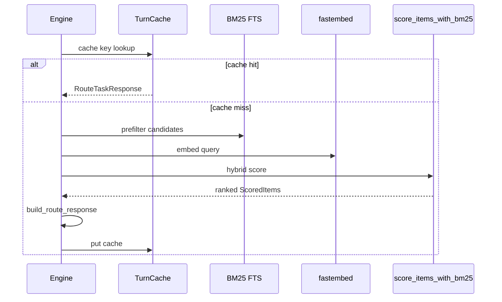

# 4. Turn routing and retrieval

## Summary

`route_task` is the core product surface. It ranks **agents, skills, rules, and memory** for one user message, returns paths and short rationales under a token budget, and caches results for identical turn fingerprints.

## What we built

### Inputs

| Parameter | Role |
|-----------|------|
| `user_message` | Primary retrieval query |
| `current_working_directory` | Repo root detection, scope boost |
| `open_files` | Optional fingerprint in cache key |
| `max_tokens` | Hard budget for serialized response |
| `limits` | Per-type caps (agents, skills, rules, memory) |
| `phase` | Optional override; else inferred from message |

### Phase inference

`workspace::infer_phase` uses keyword buckets:

- **reviewing** — review, pr, audit, lint, checklist
- **debugging** — fix, error, bug, fail, …
- **planning** — plan, design, architect, spec, …
- **implementing** — implement, build, add, test, mcp, …

Phase adds a small score boost when item topic/text aligns (see `phase_match_boost` in `store.rs`).

**Why keywords, not an LLM call:** Zero latency and cost; phase is a soft prior, not the only signal.

### Retrieval pipeline



1. **Turn cache** — Key: scope + phase + query fingerprint + index version (+ optional open files). TTL from config (`turn_ttl_secs`, default 60s).

2. **BM25 prefilter** — `retrieval::fts_query_strict` (AND across significant terms), fallback to OR if too few hits. Caps: 150 items, 40 facts.

3. **Query embedding** — Always computed for `route_task` (BM25-only fast path disabled for routing). Cached in memory LRU and `query_embeddings` table by content hash.

4. **Hybrid score** (non-memory items):

   ```text
   score = 0.55 × cosine + 0.25 × bm25_norm + 0.20 × lexical_overlap
   ```

   Fallback padding candidates with no BM25/lexical signal get a 0.5× penalty.

5. **build_route_response** — Two passes: skills/agents/rules first, then memory, so memory does not consume budget before skills.

### Skill indexing for retrieval

`index.rs` extracts YAML **`description`** and **`name`** from SKILL.md frontmatter into indexed text (not just folder name). Embeddings use `"{topic} {text}"`.

### Observability

- `retrieval_log` — query hash, phase, latency, cache hit, items JSON
- `~/.agent_brain/logs/last-route.md` — markdown briefing
- `route_task` JSON field `briefing` — one-line stderr summary

## Why return paths, not bodies

Agents have a `Read` tool. Routing should answer **which files to read**, not duplicate megabytes of skill content into MCP JSON.

**Token estimator** (`tokens.rs`) uses serialized JSON size of each recommendation to enforce `max_tokens`.

## Alternatives considered

### Return top-k full skill files in route_task

**Rejected:** Blows budget; stale if file changes after route; duplicates IDE read path.

### Single embedding index, no BM25

**Rejected:** Weak on exact terms (package names, “Vitest”, “PR”); slower full scan.

### BM25-only fast path (skip embed when FTS “strong”)

**Shipped then removed for routing:** Skipped semantic signal; wrong skills won on shared stopwords (“changes”, “the”). Embedding cost is acceptable for correctness.

### Cross-encoder reranker (e.g. mini cross-encoder)

**Deferred:** Better accuracy, higher latency and binary size. Hybrid + lexical overlap is the current accuracy/perf balance.

### LLM-as-router (call model to pick skills)

**Rejected:** Adds hundreds of ms and cost per turn; non-deterministic; harder to eval.

### Per-skill trigger regex in DB

**Considered:** ECC-style “use when” triggers in frontmatter.

**Partial:** `apply_when` exists for **memory**, not yet first-class for skills. Description text + hybrid search approximates triggers without maintaining parallel regex sets.

## Eval gate

`agent-brain eval --ci` runs golden Recall@3 on **memory** and **skills** (each threshold ≥ 0.85). See [12-routing-accuracy.md](12-routing-accuracy.md) for the accuracy model and how to extend golden cases.

## Trade-offs

- **Phase keywords** can misclassify edge messages; explicit `phase` param overrides.
- **Turn cache** can serve stale routes if index version unchanged but files edited within TTL — bump index on bootstrap mitigates.
- **Large libraries** — BM25 cap means very rare items need strong lexical/semantic match to surface.

## For senior engineers and principal architects

### Two-pass response assembly (budget economics)

`build_route_response` deliberately runs **skills/agents/rules before memory**. Without this ordering, a chatty project memory corpus consumes the JSON token budget and the agent never sees the skill path for the current task.

This is a **knapsack problem** with typed slots:

```text
max_tokens (hard)
  ├── agents  ≤ limits.agents
  ├── skills  ≤ limits.skills
  ├── rules   ≤ limits.rules
  └── memory  ≤ limits.memory  (fills remainder)
```

PE takeaway: raising `limits.memory` without raising `max_tokens` often **hurts** routing quality — memory is not “free context,” it competes for the same MCP response envelope.

### Why we disabled BM25-only fast path

The fast path skipped embedding when FTS looked “strong enough.” Production failure mode: shared stopwords (“changes”, “the”, “fix”) produced high BM25 for unrelated skills. **Correctness > ~20–40 ms embed cost** for the USP. Any future fast path must pass the **skill golden suite**, not just latency benchmarks.

### Minimum recommendation score

Weak hits are dropped relative to the top non-memory score (`minimum_recommendation_score` in `retrieval.rs`). This reduces **false-positive skills** — showing three mediocre matches trains users to ignore the router. Trade-off: vague queries may return empty skill slots (preferable to wrong skill).

### Cache key design

Turn cache includes `index_version` so re-bootstrap invalidates stale rankings without waiting for TTL. It optionally includes open files — disabling via config avoids cache fragmentation when agents open many tabs.

### Observability for routing regressions

| Artifact | Granularity | Use |
|----------|-------------|-----|
| `last-route.md` | Per turn | Human debugging |
| `retrieval_log` | Per turn | Weekly digest, analytics |
| `eval --ci` | Golden suites | CI regression gate |
| `report_context_useful` | Per item | Long-term weight tuning |

PEs should require **golden suite expansion** when onboarding a team skill pack — default ECC golden cases do not cover proprietary skills.

### Questions a PE should ask

1. What **Recall@k** target matches user trust? (We gate at 0.85 on bundled goldens.)
2. Are you willing to pay **embed-per-turn** for accuracy?
3. Do you need **explainability** beyond score + rationale string? (Not first-class today.)
4. How will you detect **silent regressions** after skill pack updates? (`index` + eval + spot-check `last-route.md`)

## Further reading

- [retrieval.rs](../../agent-brain/src/retrieval.rs)
- [engine.rs](../../agent-brain/src/engine.rs) — `route_task`, `route_query_parallel`
- [06-indexing-and-packages.md](06-indexing-and-packages.md)
